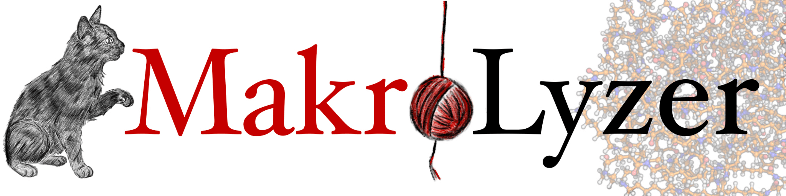

MakroLyzer - User Manual
=============================
Welcome to the user manual of the MakroLyzer program!
**MakroLyzer** is a graph based python tool for analyzing and modifying macromolecular structures of natural or synthetic origin, such as peptides or nanoplastics. 
The program has two main functionalities:

* Structure analysis of macromolecular structures
* Structure modification of macromolecular structures

.. toctree::
   :maxdepth: 1
   :caption: First Steps

   01_Installation

.. toctree::
   :maxdepth: 2
   :caption: General Information

   inputParameters/general

.. toctree::
   :maxdepth: 1
   :caption: Structure Analyzers

   structureAnalysis/01dihedral.rst
   structureAnalysis/02Rg.rst
   structureAnalysis/03anisotropy.rst
   structureAnalysis/04asphericity.rst
   structureAnalysis/05hydrogenBonds.rst
   structureAnalysis/06orderParameter.rst
   structureAnalysis/07e2e.rst
   structureAnalysis/08ramachandran.rst
   structureAnalysis/09NoSub.rst
   structureAnalysis/10formula.rst
   structureAnalysis/11surfaceAtoms.rst
   structureAnalysis/12convexHull.rst

.. toctree::
   :maxdepth: 1
   :caption: Structure Modifiers

   structureModification/01patternID.rst
   structureModification/02functionalization.rst
   structureModification/02bfunctionalizationSurface.rst
   structureModification/03saturation.rst
   structureModification/04subgraphCoords.rst
