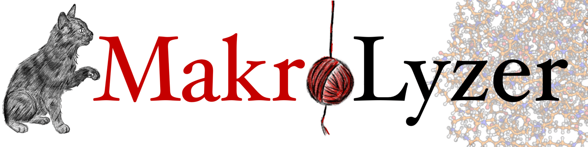

MakroLyzer - Documentation
=============================
**MakroLyzer** is a tool for analyzing macromolecular structures.

.. toctree::
   :maxdepth: 3
   :caption: First Steps

   01_Installation

.. toctree::
   :maxdepth: 3
   :caption: Usage

   02_Usage
