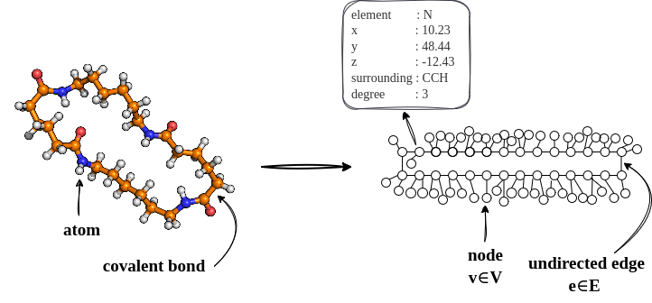

General Input Parameters
===========================

To run MakroLyzer, a structure file either in **XYZ** or **LAMMPS** format is required. 
The structure can be provided via the command line using the ``-xyz`` or ``-lmp`` flag, respectively.

.. code-block:: bash

   MakroLyzer -xyz <trajectory.xyz>
   MakroLyzer -lmp <trajectory.lmp>

MakroLyzer then reads in the structure file and creates a graph representation of the macromolecular structure.
Covalent bonds are identified using a distance criterion defined as the sum of the covalent radii of the two atoms multiplied by a factor of 1.15 to account for lattice vibrations. 
This factor can be adjusted using the ``-vf`` flag followed by a floating point number.
A table with all atom types available in MakroLyzer and their corresponding properties is provided below.

Additionally, the user can decide whether the analysis should be performed with ``--static-topology`` or if the graph is re-evaluated at each frame (default).
The static topology option is useful for analysis of structures where bonds do not change over time.

.. note::
    The ``--static-topology`` is not recommended for the modification functionalities of MakroLyzer!

If only specific molecules of the structure should be considered during the analysis or modification, the user can select them using the ``-sel`` flag followed by a selection string.
Molecules can either be selected by exact formula or an element set. An exact composition includes digits (e.g. C2H6, CH4, C1H4), while an element set only contains element symbols without digits (e.g. CHO, CNH).
The first selection would select all molecules with exactly 2 carbon and 6 hydrogen atoms, while the second selection would select all molecules that contain only carbon, hydrogen, and oxygen atoms in any ratio.
Multiple selections can be provided separated by space (e.g. ``-sel C2H6 CH4 CHO``).

In case the user does not want to analyze the structure at each frame, the ``-nth`` flag can be used, followed by an integer number to analyze every n-th frame of the trajectory.

Backbone determination
======================
For some structure analysis, such as dihedral angle calculation along the backbone of a macromolecule, the backbone of each connected subgraph needs to be determined.
The backbone is determined by MakroLyzer in two distinct ways, depending on whether the specific polymer is a chain or forms a cycle. 
When the subgraph is a chain, the backbone is determined by first removing all nodes with a degree equal to one, i.e., the atoms with a single covalent bond. 
These nodes are typically hydrogen atoms or double-bonded oxygen atoms and are not considered part of the backbone by definition. 
Then, depth-first searches are conducted starting at atoms that now have a degree of one to identify the longest path, which corresponds to the backbone of the polymer strand. 
When the strand forms a cycle, the Paton algorithm for finding a fundamental set of cycles within a graph is applied, as implemented in the NetworkX Python package. 
The program automatically identifies whether a strand is a cycle or a chain. 
Therefore, users do not need to provide this detail. 

.. note::
  For more complex cases like cross-linked or branched polymers, MakroLyzer cannot currently determine the "correct" backbone.

Atom Parameters
===========================
The following table lists all element types currently available in MakroLyzer, along with their atomic mass, van der Waals (vdW) radius [1], and covalent radius [2].

.. list-table::
   :widths: 25 25 25 25
   :header-rows: 1

   * - Element type
     - Mass [u]
     - vdW radius [Å]
     - Covalent radius [Å]
   * - H
     - 1.008
     - 1.20
     - 0.31
   * - C
     - 12.011
     - 1.70
     - 0.76
   * - N
     - 14.007
     - 1.55
     - 0.71
   * - O
     - 15.999
     - 1.52
     - 0.66
   * - F
     - 18.998
     - 1.47
     - 0.57
   * - P
     - 30.974
     - 1.80
     - 1.07
   * - S
     - 32.065
     - 1.80
     - 1.05
   * - Li
     - 6.941
     - 1.81
     - 1.28
   * - Na
     - 22.990
     - 2.27
     - 1.66
   * - K
     - 39.098
     - 2.75
     - 2.03
   * - Mg
     - 24.305
     - 1.73
     - 1.41
   * - Ca
     - 40.078
     - 2.31
     - 1.76
   * - B
     - 10.811
     - 1.65
     - 0.84
   * - Ag
     - 107.868
     - 1.72
     - 1.45
   * - Au
     - 196.967
     - 1.66
     - 1.36
   * - D
     - 0.00
     - 0.00
     - 0.00
   * - X
     - 1.00
     - 0.00
     - 0.00

.. [1] A. Bondi, van der Waals Volumes and Radii, J. Phys. Chem. 68 (3) (1964) 441-451.
       DOI: doi.org/10.1021/j100785a001
.. [2] B. Cordero, V. Gómez, A. Platero-Prats, M. Revés, J. Echeverría, E. Cremades, F. Barragán, S. Alvarez, Covalent radii revisited, Journal of the Chemical Society. Dalton Transactions (2008), 2832–2838
       DOI: doi.org/10.1039/b801115j
