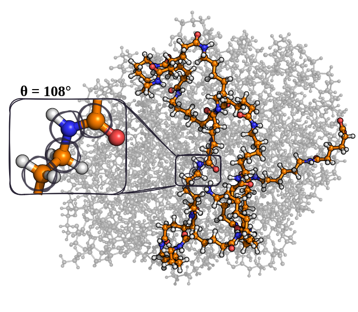

Dihedral Angles and Cis/Trans [1]_
==================================

This analyzer computes dihedral angles along the backbone of each (selected) connected subgraph.
The angles are rounded to integer degrees and binned into 1-degree bins.

Command Line Input
------------------
.. line-block::
  ``-d``
  ``--dihedral``
      Calculate dihedral angles. Optionally provide a base output filename.
      *Default: dihedrals.csv*

  ``--dihedral-range {abs,nonabs}``
      ``abs`` gives 0-180 degrees (absolute angles), ``nonabs`` gives -179-180 degrees.
      *Default: abs*

  ``--special-dihedral``
      Take only certain dihedrals into account.
      Provide the atom types of the four consecutive elements along the backbone you want to calculate the dihedral angles for.
      Usage example: -d --special-dihedral OCCO

By default, the filenames are **dihedrals.csv**, **dihedrals_list.csv**, and **cisTrans.csv**.
The basename for the first two files can be changed by providing the desired name after the ``-d`` or ``--dihedral`` flag.

Example
^^^^^^^
.. code-block:: bash

   MakroLyzer -xyz polymer.xyz -d --dihedral-range nonabs

Outputs
-------
The dihedral analyzer writes three files:

- ``dihedrals.csv``: Dihedral angle counts per frame.
  The first column is *Angle* and each additional column is *Frame <idx>*.

- ``dihedrals_list.csv``: One row per subgraph and frame with the angle list sorted along the backbone.
  
- ``CisTrans.csv``: Cis/trans counts per frame, plus longest consecutive cis and trans passages.
  Column order: ``Frame, Cis count, Trans count, Longest consecutive cis, Longest consecutive trans``.

Cis/trans classification uses :math:`|\theta| \le 90` degrees for cis and
:math:`90 < |\theta| \le 180` degrees for trans.

.. [1] Drysch, K.; Dawer, Y.; Zaby, P.; Buchmüller, K.; Dick, L.; Mutzel, P.; Hollóczki, O.; Kirchner, B. MakroLyzer: A Graph-Based Software to Comb through Molecular Hairballs Using the Example of Nanoplastics. J. Phys. Chem. B 2025
       DOI: 10.1021/acs.jpcb.5c06175
