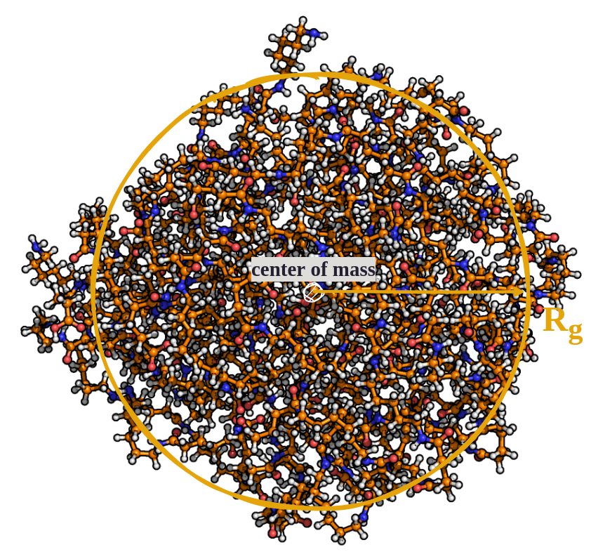

Radius of Gyration 
==================

The radius of gyration :math:`R_g` quantifies the spatial extent of a structure around its center of mass. 
MakroLyzer reports a single value per frame for the full graph.

Definition
----------
The squared radius of gyration is defined as

.. math::

   R_g^2 = \frac{1}{N} \sum_{i=1}^{N} \left(\vec{r}_i - \vec{r}_{\mathrm{com}}\right)^2

where :math:`N` is the number of atoms in the graph, :math:`\vec{r}_i` is the position vector of atom :math:`i`, and :math:`\vec{r}_{\mathrm{com}}` is the center of mass position vector of the graph.

Additionally, the radius of gyration tensor G is computed as

.. math::

   \textbf{G}_{m,n} = \frac{1}{N} \sum_{i=1}^{N} \left(\vec{r}_i^{(m)} - \vec{r}_{\mathrm{com}}^{(m)}\right) \left(\vec{r}_i^{(n)} - \vec{r}_{\mathrm{com}}^{(n)}\right)

with :math:`\vec{r}_i^{(m)}` representing the :math:`m^{\mathrm{th}}` Cartesian coordinates of the position vector of the :math:`i^{\mathrm{th}}` particle,
and thus, G describes a symmetric 3 :math:`\times` 3 matrix:
It is used for the calculation of the anisotropy factor and the asphericity parameter.

Command Line Input
------------
.. line-block::
  ``-Rg``
  ``--radiusOfGyration``
      Calculate :math:`R_g`. Optionally provide an output filename.
      *Default: Rg.csv*

Example
^^^^^^^
.. code-block:: bash

   MakroLyzer -xyz polymer.xyz -Rg myRgOutput.csv

Output
------
The output file contains one row per frame with the following columns:

.. list-table::
   :widths: 30 70
   :header-rows: 1

   * - Column
     - Description
   * - Frame
     - Frame index in the trajectory 
   * - Rg / Angstrom
     - Radius of gyration for the full graph