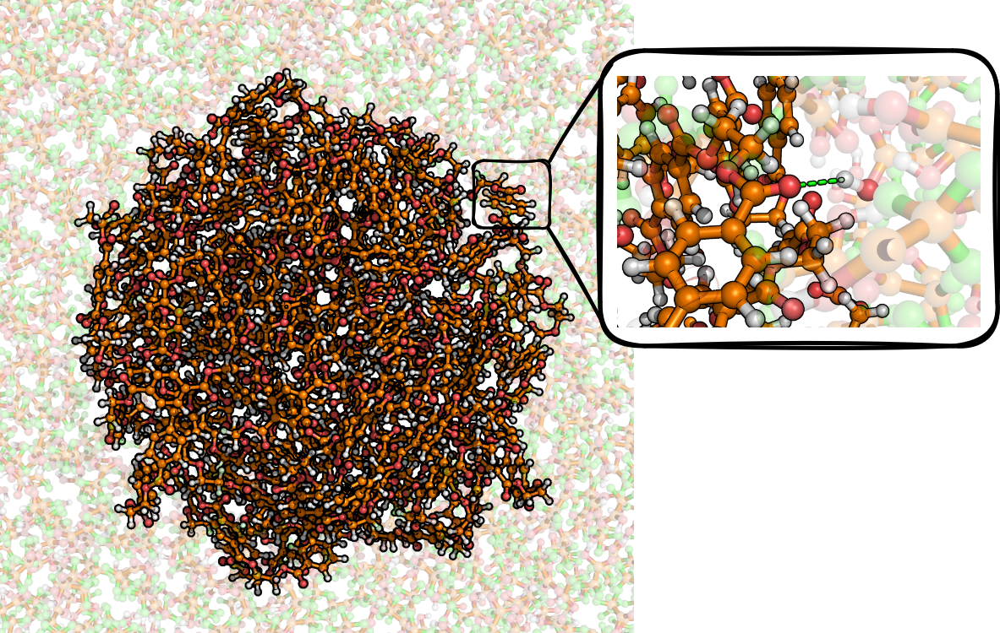

Hydrogen Bonds [1]_
===================

This analyzer counts hydrogen bonds using geometric cutoffs.

.. figure:: ../figures/structureAnalysis/03hb.png
   :width: 300
   :align: center
   :alt: HB

.. raw:: html

   

Additionally, the hydrogen bond count can be calculated between two selections, like between a polymer and the solvent. 

.. raw:: html

   

Command line
------------
.. line-block::
  ``-hb A:b:c:alpha``
  ``--hydrogenBonds``
      Count hydrogen bonds for one or more acceptor types.
      ``A`` is the acceptor element symbol
      ``b`` is the maximum hydrogen atom (H) - acceptor atom (A) distance (float)
      ``c`` maximum donor atom (D) - acceptor atom distance (float)
      ``alpha`` is the maximum angle in degrees between the D-H and H-A vectors (float)

  ``-hb-file``
  ``--hbonds-file``
      Output filename.
      *Default: hydrogenBonds.csv*

  ``-hb-pos``
  ``--hbondPositions``
      Write one XYZ file per frame with H-bond midpoint positions.
      Requires ``--hydrogenBonds``.
      Optionally provide a base output filename.
      *Default: hbondPositions.xyz*
  
  ``-hb-between SEL1 SEL2``
  ``--hb-between SEL1 SEL2``
      Count only hydrogen bonds between two selected species.
      Requires ``--hydrogenBonds`` to define the hydrogen-bond cutoffs.
      Hydrogen bonds within either selected species are ignored.
      The selections use the same subgraph-selection syntax as ``-sel``.

  ``-hb-between-file``
  ``--hb-between-file``
      Output filename for hydrogen bonds between two selections.
      *Default: hydrogenBondsBetween.csv*

Example
^^^^^^^

.. code-block:: bash

   MakroLyzer -xyz polymer.xyz -hb O:2.4:3.4:30 -hb-file myHbondOutput.csv
   MakroLyzer -xyz solvated_polymer.xyz -hb O:2.4:3.4:30 -hb-between CHON H2O
   MakroLyzer -xyz polymer.xyz -hb O:2.4:3.4:30 -hb-pos myHbondPositions.xyz

Output
------
The output file contains one row per frame and cutoff:

.. list-table::
   :widths: 30 70
   :header-rows: 1

   * - Column
     - Description
   * - Frame
     - Frame index in the trajectory
   * - Element Type
     - Acceptor element symbol
   * - H-Acceptor dist
     - Cutoff distance ``b``
   * - Donor-Acceptor dist
     - Cutoff distance ``c``
   * - Angle cutoff
     - Cutoff angle ``alpha`` (degrees)
   * - Number of Hydrogen Bonds
     - Count for this cutoff

For hydrogen bonds between two selections, the output file contains the same cutoff information and additionally lists the two selections:

.. list-table::
   :widths: 30 70
   :header-rows: 1

   * - Column
     - Description
   * - Frame
     - Frame index in the trajectory
   * - Selection 1
     - First selected species
   * - Selection 2
     - Second selected species
   * - Element Type
     - Acceptor element symbol
   * - H-Acceptor dist
     - Cutoff distance ``b``
   * - Donor-Acceptor dist
     - Cutoff distance ``c``
   * - Angle cutoff
     - Cutoff angle ``alpha`` (degrees)
   * - Number of Hydrogen Bonds
     - Count of hydrogen bonds between the two selections for this cutoff

.. [1]  Drysch, K.; Dawer, Y.; Zaby, P.; Buchmüller, K.; Dick, L.; Mutzel, P.; Hollóczki, O.; Kirchner, B. MakroLyzer: A Graph-Based Software to Comb through Molecular Hairballs Using the Example of Nanoplastics. J. Phys. Chem. B 2025
       DOI: 10.1021/acs.jpcb.5c06175
