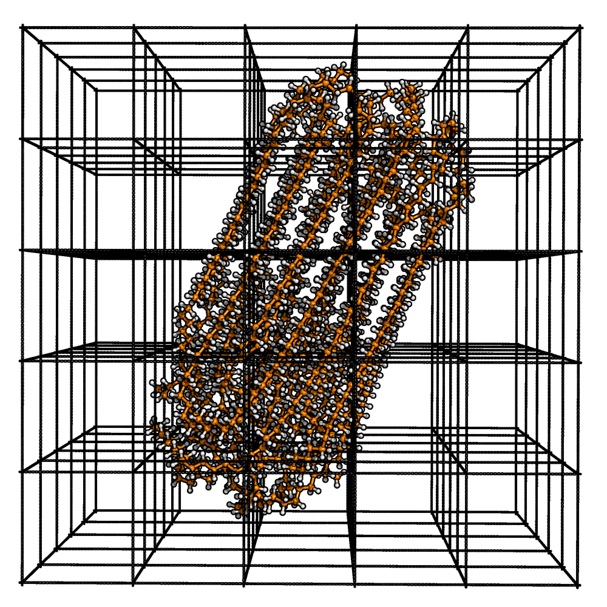

Order Parameter S* [1]_
=======================

The nematic order parameter :math:`S^*` measures the orientational order of the molecular backbones. MakroLyzer calculates :math:`S^*` from the largest eigenvalue of a local Q' tensor built from backbone vectors.

:math:`S^*` is closely related to the nematic order parameter :math:`S` used in liquid crystal physics. The classical definition is:

.. math::

   S = \frac{1}{2} \langle 3 \cos^2(\theta) - 1 \rangle

where :math:`\theta` is the angle between each molecular orientation vector and a reference direction, and the brackets denote an average over molecules. The reference direction is often described as the "average orientation", but because vector directions are arbitrary, this is not strictly defined.

The Q tensor for uniaxial systems is defined as:

.. math::

   Q = S \left( \frac{3}{2} \hat{n} \otimes \hat{n} - \frac{1}{2} I \right)

where :math:`\hat{n}` is the director (unit orientation vector) and :math:`I` is the identity matrix. Because :math:`\hat{n}` is not known a priori, MakroLyzer builds the helper tensor :math:`Q'` from backbone vectors and extracts :math:`S^*` from its largest eigenvalue.

Definition
----------
The Q' tensor is defined as

.. math::

   Q' = \frac{1}{N} \sum_i \left( \frac{3}{2} (\hat{u}_i \otimes \hat{u}_i) - \frac{1}{2} I \right)

where :math:`N` is the number of backbone vectors in the cell, and :math:`\hat{u}_i` is the unit vector along backbone vector :math:`i`.
:math:`Q` and :math:`Q'` share the same eigenvalues, so :math:`S^*` is taken as the largest eigenvalue of :math:`Q'`. :math:`S` and :math:`S^*` differ only when :math:`S` is negative. 
The :math:`S^*` range is :math:`[0, 1]`, while :math:`S` is typically reported in :math:`[-0.5, 1]`. A value of :math:`S^* = 1` indicates perfect alignment, while :math:`S^* = 0` indicates isotropic orientation.

The space is divided into ``NoCellsPerDim``\ :sub:`x` :math:`\times` ``NoCellsPerDim``\ :sub:`y` :math:`\times` ``NoCellsPerDim``\ :sub:`z` cells.
For each cell, the Q' tensor is built, and the :math:`S^*` value is calculated from all backbone vectors whose midpoints lie within the cell.
Cells with fewer than three backbone vectors are skipped.
The final value is the average across all valid cells.

Command line
------------
.. line-block::
  ``-op BoxSize:NoCellsPerDim:MolecularVectorLength``
  ``--orderParameter``
      ``BoxSize`` is the box length (one value or x:y:z - float), ``NoCellsPerDim`` is the
      number of cells per dimension (one value or x:y:z - int), and ``MolecularVectorLength``
      is the number of consecutive backbone atoms used for each vector.
      *Example: -op 100.2:1:3*

  ``-op-file``
  ``--order-file``
      Output filename.
      *Default: orderParameter.csv*

Example
^^^^^^^
.. code-block:: bash

    MakroLyzer -xyz polymer.xyz -op 100.2:1:3 -op-file myOrderParameterOutput.csv

Output
------
The output file contains one row per frame:

.. list-table::
   :widths: 30 70
   :header-rows: 1

   * - Column
     - Description
   * - Frame
     - Frame index in the trajectory 
   * - Order Parameter S*
     - Average :math:`S^*` across cells

.. [1]  Drysch, K.; Dawer, Y.; Zaby, P.; Buchmüller, K.; Dick, L.; Mutzel, P.; Hollóczki, O.; Kirchner, B. MakroLyzer: A Graph-Based Software to Comb through Molecular Hairballs Using the Example of Nanoplastics. J. Phys. Chem. B 2025
       DOI: 10.1021/acs.jpcb.5c06175