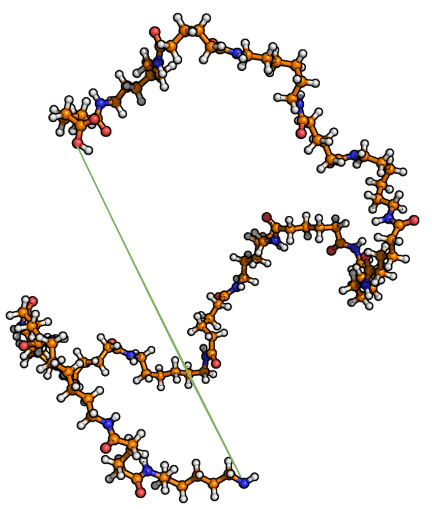

End-to-End Distance [1]_
========================

The end-to-end distance measures the distance between the first and last backbone
atoms of each connected subgraph (after removing 1-order nodes).

Command line
------------
.. line-block::
  ``-e2e``
  ``--endToEndDistance``
      Calculate end-to-end distances. Optionally provide an output filename.
      *Default: endToEndDistances.csv*

Example
^^^^^^^
.. code-block:: bash

   MakroLyzer -xyz polymer.xyz -e2e

Output
------
Each row starts with the frame index followed by one distance per subgraph. 
The number of distance columns depends on the number of connected subgraphs.

.. [1]  Drysch, K.; Dawer, Y.; Zaby, P.; Buchmüller, K.; Dick, L.; Mutzel, P.; Hollóczki, O.; Kirchner, B. MakroLyzer: A Graph-Based Software to Comb through Molecular Hairballs Using the Example of Nanoplastics. J. Phys. Chem. B 2025
       DOI: 10.1021/acs.jpcb.5c06175