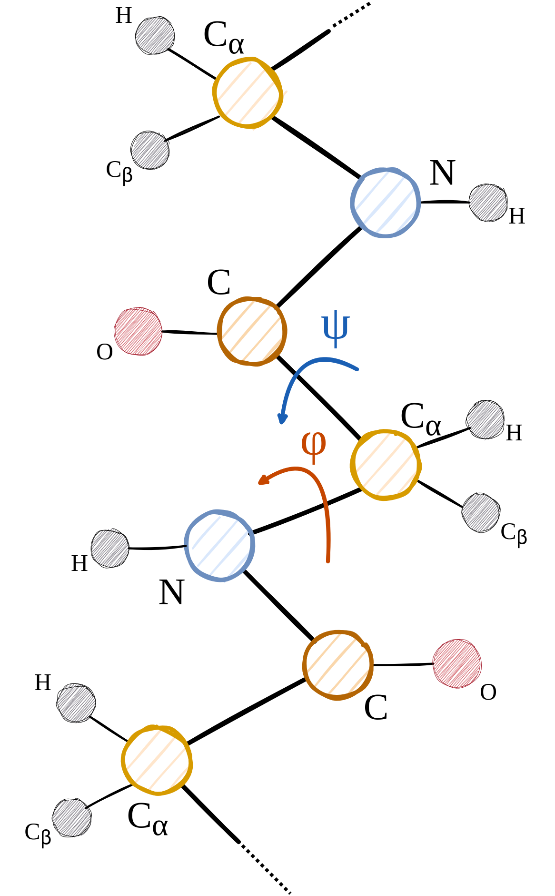
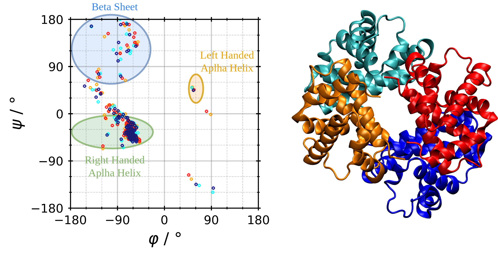

Ramachandran Matrix
===================
The Ramachandran matrix tabulates backbone :math:`\varphi` and :math:`\psi` dihedral angles for amino-acid and alternative amino-acid backbones, which are defined by the four consecutive backbone atoms :math:`N-C_\alpha-C-N`.

Definition
----------
Definition of the backbone dihedral angles :math:`\varphi` and :math:`\psi`:

.. math::

   \varphi &= \angle ~ C_{i}-N_{i+1}-C_\alpha{i+2}-C_{i+3} \\
   \psi &= \angle ~ N_{i+1}-C_\alpha{i+2}-C_{i+3}-N_{i+4}

Command line
------------
.. line-block::
  ``-Ramachandran``
  ``--Ramachandran``
      Calculate the Ramachandran matrix. Optionally provide an output filename.
      *Default: AARamachandran.csv*

Example
^^^^^^^
.. code-block:: bash

   MakroLyzer -xyz peptide.xyz -Ramachandran

Angles are rounded to integers and shifted by +180 to map to 0-359 degrees.
Below we show an example Ramachandran plot for hemoglobin.

Output
------
Each frame is written as a separate matrix file named ``<base>_frame<idx>.csv``.
Each file is a 360x360 CSV matrix where rows are :math:`\phi` (0-359) and columns are :math:`\psi` (0-359).

