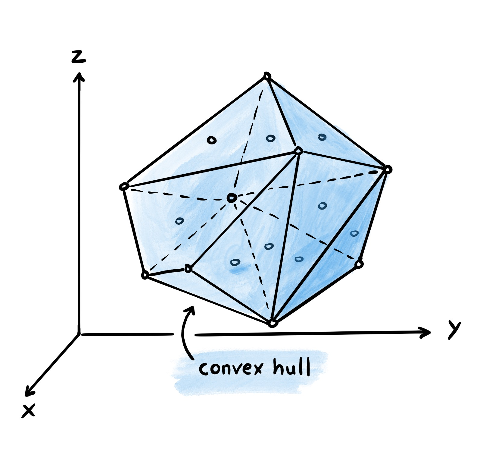

Convex Hull Volume and Density [1]_
====================================

The convex hull of a particle is the smallest convex shape that can enclose all atoms of the particle.
In MakroLyzer, the convex hull is computed using ``scipy.spatial.ConvexHull`` [2]_.
The volume of the convex hull can be used as a measure of the particle's desnity, which is calculated as the mass of the particle divided by the volume of the convex hull.

Because the convex hull approximates the spatial extent of a particle, it can be used to determine whether other particles penetrate the selected particle. 
For example, in a solvated polymer, this makes it possible to count how many solvent molecules have their center of mass within the polymer's convex hull. 

Command line
------------
.. line-block::
  ``-ConvHullVol``
  ``--convexHullVolume``
      Calculate the volume of the convex hull spanned by a particle. Additionally, the mass of the polymer as well as the density (mass/volume) are calculated. Optionally provide an output filename 
      *Default: ConvexHullVolume.csv*

  ``-ConvHullSol PARTICLE_SEL SOLVENT_SEL``
  ``--convexHullSolvent PARTICLE_SEL SOLVENT_SEL``
      Calculate the convex hull of the selected particle molecules and count how many selected solvent molecules have their center of mass inside that hull.
      The two selections use the same subgraph-selection syntax as ``--hb-between``.
      *Default output: ConvexHullSolvent.csv*

  ``-ConvHullSol-file``
  ``--convexHullSolvent-file``
      Optional output filename for the convex-hull solvent count.

Example
^^^^^^^
.. code-block:: bash

   MakroLyzer -xyz polymer.xyz -ConvHullVol
   MakroLyzer -xyz solvated_polymer.xyz -ConvHullSol CHON H2O

Output
------
Each row starts with the frame index followed by the volume of the convex hull, the mass of the particle and the density (mass/volume) in CSV format.
For solvent counting, each row starts with the frame index followed by the particle selection, solvent selection, convex hull volume and the number of solvent molecules inside the convex hull.

.. [1]  Drysch, K.; Dawer, Y.; Zaby, P.; Buchmüller, K.; Dick, L.; Mutzel, P.; Hollóczki, O.; Kirchner, B. MakroLyzer: A Graph-Based Software to Comb through Molecular Hairballs Using the Example of Nanoplastics. J. Phys. Chem. B 2025
       DOI: 10.1021/acs.jpcb.5c06175
.. [2]  Virtanen, P.; Gommers, R.; Oliphant, T. E.; Haberland, M.; Reddy, T.; Cournapeau, D.; et al. SciPy 1.0: Fundamental Algorithms for Scientific Computing in Python. Nat. Methods 2020, 17, 261-272.
       DOI: 10.1038/s41592-019-0686-2
