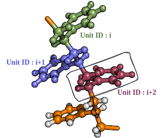

Pattern IDs
===========

This modifier assigns unit/fragment IDs to user-defined patterns in the molecular graph.
The patterns are matched along backbone paths and written as an XYZ-style output with an extra ``FragmentID`` column.

Command line
------------
.. line-block::
  ``-p``
  ``--patternFile``
      Path to a pattern definition file (TXT).

  ``-pID-file``
  ``--patternID-file``
      Output filename for the pattern IDs.
      *Default: patternIDs.csv*

Pattern file format
^^^^^^^^^^^^^^^
The pattern file is a plain text file with one or two non-empty lines:

- Line 1: A Python-style list of lists describing patterns, e.g.::

      [["O_CC", "C_CO", "C_CO"], ["C_CC", "C_CC"]]

- Line 2 (optional): A start atom element symbol used to anchor the backbone search.

The pattern file must provide the patterns of the constituent monomer units. 
Element-type strings are describing each atom in the repeating unit by its element and the elements of its covalently bonded neighbors, in alphabetic order (excluding terminal atoms).

Example pattern file content:

.. list-table:: Polymers and possible monomer patterns.
   :widths: 20 80
   :header-rows: 1

   - - **Structure**
     - **Possible monomer pattern**
   - - Polyethylene
     - ``["C_CC", "C_CC"]``
   - - Polystyrene
     - ``["C_CC", "C_CCC", "C_CCC", "C_CC", "C_CC", "C_CC", "C_CC", "C_CC"]``
   - - Polyethylene glycol
     - ``["O_CC", "C_CO", "C_CO"]``
   - - Polypropylene
     - ``["C_CC", "C_CCC", "C_C"]``
   - - Polyacrylic acid
     - ``["C_CC", "C_CCC", "C_CO", "O_C"]``
   - - Nylon 66
     - ``["C_CN", "C_CC", "C_CC", "C_CC", "C_CC", "C_CN", "N_CC", "C_CN", "C_CC", "C_CC", "C_CC", "C_CC", "C_CN", "N_CC"]``
   - - Nylon 6
     - ``["C_CO", "C_CC", "C_CC", "C_CC", "C_CC", "C_CO", "O_CC"]``
   - - Nylon 46
     - ``["C_CN", "C_CC", "C_CC", "C_CC", "C_CC", "C_CN", "N_CC", "C_CN", "C_CC", "C_CC", "C_CN", "N_CC"]``
   - - Nylon 11
     - ``["N_CC", "C_CN", "C_CC", "C_CC", "C_CC", "C_CC", "C_CC", "C_CC", "C_CC", "C_CC", "C_CC", "C_CN"]``
   - - Nylon 12
     - ``["N_CC", "C_CN", "C_CC", "C_CC", "C_CC", "C_CC", "C_CC", "C_CC", "C_CC", "C_CC", "C_CC", "C_CC", "C_CN"]``

Example
^^^^^^^
.. code-block:: bash

   MakroLyzer -xyz polymer.xyz -p patterns.txt -pID-file patternIDs.csv

Output
------
The output is an XYZ-style file with a fragment ID per atom:

- Header: ``element x y z FragmentID``
- Atoms not matched to any pattern are assigned ``FragmentID = -1``.
