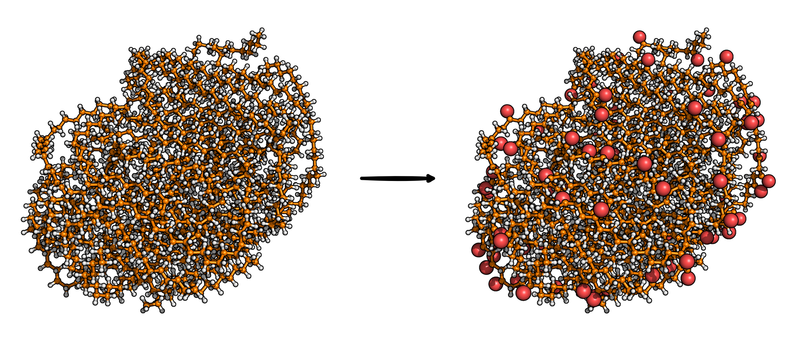

Polyethylene Surface Functionalization [1]_
===========================================

This modifier functionalizes polyethylene (PE) surfaces by replacing selected CH2 units at
the particle surface with CO groups. Surface atoms are identified using the GITIM algorithm
from pytim [2]_ [3]_ on an MDAnalysis universe [4]_. A random subset of eligible backbone carbons
is chosen.
End-group carbons are excluded.

Command line
------------
.. line-block::
  ``-funcPEsurf percentage:CO``
  ``--functionalizePEsurface``
      Functionalize PE surface by replacing CH2 groups with CO groups.
      ``percentage`` is an integer from 0 to 100.

  ``-funcPE-file``
  ``--functionalizePE-file``
      Output filename.
      *Default: functionalizedPE.xyz*

Example
^^^^^^^
.. code-block:: bash

   MakroLyzer -xyz PE.xyz -funcPEsurf 15:CO -funcPE-file PE_CO.xyz

Notes
-----
- Only ``CO`` functionalization is supported so far.
- Chain-end carbons (with only one carbon neighbor) are excluded.

Output
------
An XYZ file containing the modified structure.

.. [1]  Drysch, K.; Dawer, Y.; Zaby, P.; Buchmüller, K.; Dick, L.; Mutzel, P.; Hollóczki, O.; Kirchner, B. MakroLyzer: A Graph-Based Software to Comb through Molecular Hairballs Using the Example of Nanoplastics. J. Phys. Chem. B 2025
       DOI: 10.1021/acs.jpcb.5c06175
.. [2]  Sega, M.; Kantorovich, S.; Jedlovszky, P.; Jorge, M. The generalized identification of truly interfacial molecules (ITIM) algorithm for nonplanar interfaces. J. Chem. Phys. 2013, 138, 044110.
       DOI: 10.1063/1.4774361
.. [3] Sega, M.; Hantal, G.; Fábián, B.; Jedlovszky, P. Pytim: A Python Package for the Interfacial Analysis of Molecular Simulations. J. Comput. Chem. 2018, 39, 2118-2125
       DOI:  10.1002/jcc.25384
.. [4]  Michaud-Agrawal, N.; Denning, E. J.; Woolf, T. B.; Beckstein, O. MDAnalysis: A toolkit for the analysis of molecular dynamics simulations. J. Comput. Chem. 2011, 32, 2319-2327.
       DOI: 10.1002/jcc.21787
