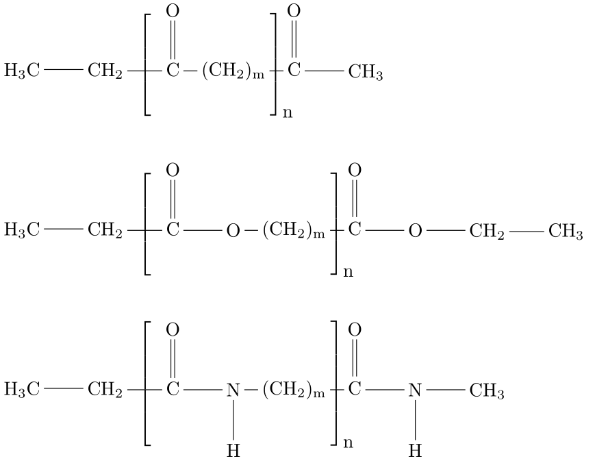

Polyethylene Functionalization 
===================================

.. figure:: ../figures/structureModification/02funcPE3.png
   :width: 800
   :align: center

This modifier functionalizes polyethylene (PE) by replacing selected CH2 units with
CO, ester, or amide groups. The functionalization can be random (percentage-based)
or periodic (fixed spacing along the backbone). End-group carbons are excluded.

Functionalization types
-----------------------
- ``CO`` replaces CH2 with a carbonyl group. 
- ``COH``replaces CH2 with a hydroxy group.
- ``ester`` replaces CH2-CH2 with COO.
- ``amide`` replace CH2-CH2 with CONH.

Modes
-----
- ``Random`` mode selects a target number of CH2 sites based on the requested ``percentage`` and then chooses positions at random while respecting the ``neighbor_exclusion`` to keep functional groups separated. A neighbor_exclusion value of three means, that between two functional groups are at least three untouched CH2 units.

- ``Periodic`` mode places functional groups at a fixed interval along the backbone using the provided ``distance`` (m). A distance of three means, that between two functional groups are three untouched CH2 units. For the CO, ester and amide functionalization types, a functionalized polymer stand can look like this:

Command line
------------
.. line-block::
  ``-funcPE random:percentage:func_type:neighbor_exclusion``
  ``--functionalizePE``
      Random functionalization of PE by replacing CH2 groups with ``func_type``.
      ``percentage`` is a float from 0 to 100.
      ``neighbor_exclusion`` is the minimum C-C hop distance between functional groups.

  ``-funcPE periodic:distance:func_type``
  ``--functionalizePE``
      Periodic functionalization along the backbone.
      ``distance`` is the spacing between functional groups (integer >= 1).
      ``func_type`` is ``CO``, ``COH``, ``ester``, or ``amide``.

  ``-funcPE-file``
  ``--functionalizePE-file``
      Output filename.
      *Default: functionalizedPE.xyz*

Example
^^^^^^^
.. code-block:: bash

   MakroLyzer -xyz PE.xyz -funcPE random:15:CO:2 -funcPE-file PE_CO.xyz
   MakroLyzer -xyz PE.xyz -funcPE periodic:6:ester -funcPE-file PE_ester.xyz

.. note::

    - Chain-end carbons (with only one carbon neighbor) are excluded from functionalization.
    - For ring polyethylene, the distance criterion might not be met for two adjacent functional groups per ring. 

Output
------
An XYZ file containing the modified structure.
