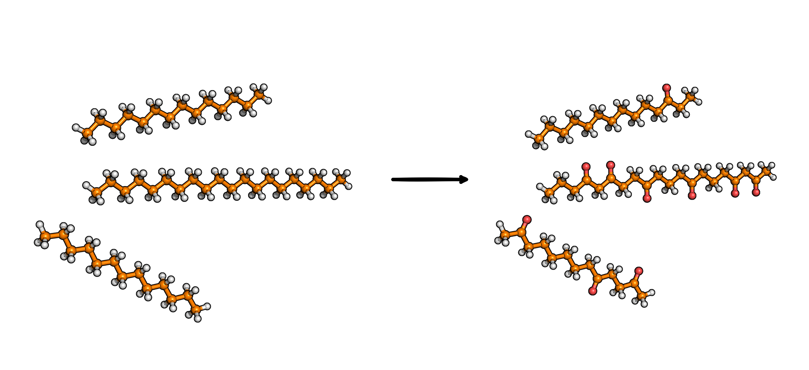

Polyethylene Functionalization [1]_
===================================

This modifier functionalizes polyethylene (PE) by replacing selected CH2 units with
CO groups. A random subset of eligible backbone carbons is chosen.
End-group carbons are excluded.

Command line
------------
.. line-block::
  ``-funcPE percentage:CO``
  ``--functionalizePE``
      Functionalize PE by replacing CH2 groups with CO groups.
      ``percentage`` is an integer from 0 to 100.

  ``-funcPE-file``
  ``--functionalizePE-file``
      Output filename.
      *Default: functionalizedPE.xyz*

Example
^^^^^^^
.. code-block:: bash

   MakroLyzer -xyz PE.xyz -funcPE 15:CO -funcPE-file PE_CO.xyz

Notes
-----
- Only ``CO`` functionalization is supported so far.
- Chain-end carbons (with only one carbon neighbor) are excluded.

Output
------
An XYZ file containing the modified structure.

.. [1]  Drysch, K.; Dawer, Y.; Zaby, P.; Buchmüller, K.; Dick, L.; Mutzel, P.; Hollóczki, O.; Kirchner, B. MakroLyzer: A Graph-Based Software to Comb through Molecular Hairballs Using the Example of Nanoplastics. J. Phys. Chem. B 2025
       DOI: 10.1021/acs.jpcb.5c06175