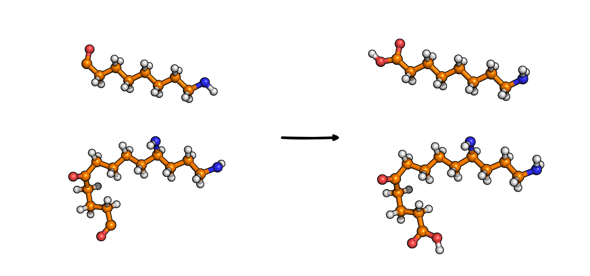

Saturation [1]_
===============

This modifier saturates polymer chain ends by adding terminal atoms. 
Terminal carboxylic carbon atoms receive OH groups and terminal amide nitrogens receive H.

Command line
------------
.. line-block::
  ``-s``
  ``--saturation``
      Saturate chain ends.
      *Default: saturatedPolymers.xyz*

Example
-------
.. code-block:: bash

   MakroLyzer -xyz polymer.xyz -s -saturatedPolymer.xyz

Output
------
An XYZ file containing the saturated structure. 
For trajectories, multiple output files are created with suffixes if files already exist.

.. [1]  Drysch, K.; Dawer, Y.; Zaby, P.; Buchmüller, K.; Dick, L.; Mutzel, P.; Hollóczki, O.; Kirchner, B. MakroLyzer: A Graph-Based Software to Comb through Molecular Hairballs Using the Example of Nanoplastics. J. Phys. Chem. B 2025
       DOI: 10.1021/acs.jpcb.5c06175